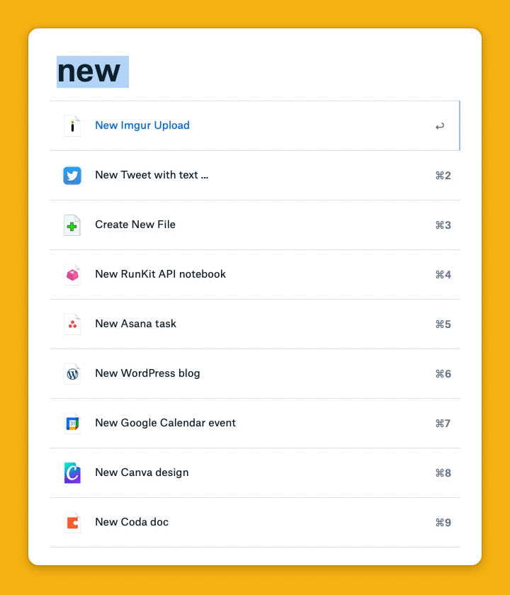
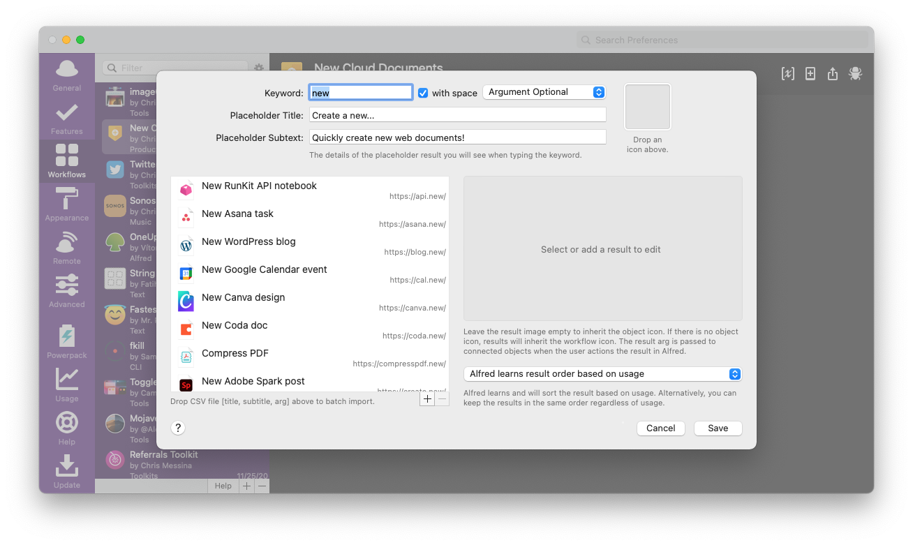

# New Cloud Documents for Alfred

[.new](https://whats.new/) is a domain extension exclusively for performing new actions online: any act that leads to creation can have a quick and memorable .new shortcut associated with it.

This Alfred Workflow allows you to quickly create new cloud documents simply by invoking the 'new' keyword, a space, and then selecting from the list of available options.

# Installation

1. Download and unzip [this file](https://github.com/chrismessina/alfred-new-cloud-documents/raw/main/dot-new-alfred-workflow.alfredworkflow).
2. Double-click `dot-new-alfred-workflow.alfredworkflow` to install it.

_You will need to be an [Alfred Powerpack](https://www.alfredapp.com/powerpack/) user to enable this workflow._

# Usage

Activate Alfred and type `new`. You can then select from a list of existing .new cloud documents (with a few bonuses thrown in):

Among the list of services included:

* Anchor
* Adobe
* Asana
* Bitly
* Canva
* Coda
* CodePen
* CodeSandbox
* Discord
* Dropbox Transfer
* eBay
* Google App Scripts
* Google Calendar
* Google Docs
* Google Drawings
* Google Forms
* Google Keep
* Google Slides
* Google Sheets
* Github
* Imgur
* Medium
* Jamstack
* OpenTable
* Prezi
* Product Hunt
* Runkit
* Shopify
* Spotify
* Stripe
* Visual Studio
* Webex
* WIP

## Customizing

You can add new services to the workflow simply by adding a new shortcut to the List Filter that includes a Title, Subtitle, and argument (i.e. the URL used to create a new document). An icon is optional, but preferable.

# Changelog[¹](https://keepachangelog.com/)

## [0.3.1] - 2020-11-26
### Added
- Added OneUpdater
- Added new Brdg Introduction
- Added new Notion page
- Moved to new repo

### Changed
- Updated Google icons
- Updated Discord icon
- Use "New" instead of "Create" verb

## [0.3.0] - 2020-10-31
### Added
- Dropbox Transfer
- Google App Scripts
- Imgur
- [Jamstack](https://jamstack.new/info/)
- OpenTable
- Vercel
- Visual Studio

### Changed
- Changed titles to describe output of command (no longer using domains for titles)
- Removed subtitles
- Updated Medium icon

## [0.2.0] - 2020-08-06

### Added
- Added support for [CodeSandbox](https://codesandbox.io/)[1](https://twitter.com/compuives/status/1291020566221205511?s=21) and [WIP](https://wip.chat/) shortcuts (h/t [Nathan Gathright](https://nathangathright.com/))
- Added another dozen or so of recently added services.

## [0.1.1] - 2020-06-08

### Added
- Added Workflow description and add link to homepage.

## [v0.1.0] - 2020-06-05
- Initial Release

# About

This workflow is unaffiliated with nor endorsed by the [Google Domain Registrar](https://www.registry.google/).

You can [file bugs](https://github.com/chrismessina/alfred-new-cloud-documents/issues/new) or [submit feature requests](https://github.com/chrismessina/alfred-new-cloud-documents/issues/new) on GitHub using the label `workflow:new-cloud-documents`.
